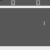

[](https://travis-ci.com/mjanschek/pytorch_seed_rl) 
[](https://pytorch-seed-rl.readthedocs.io/)

# PyTorch SEED RL
A PyTorch implementation of SEED, originally created by Google Research for TensorFlow 2.

This project has initially been designed as part of the master thesis *Scaling Reinforcement Learning* by Michael Janschek.

Trained model files are included in the `data` subfolder.
<br/><br/>

<p align="center">
  
  &nbsp; &nbsp;
  
</p>

## References
* [Online Documentation][1]
* [Example Notebook][2]
* [Original SEED Repository][3]
* [SEED RL Paper][4]

[1]: https://pytorch-seed-rl.readthedocs.io/ "Online documentation"
[2]: examples/learning_experiment.ipynb "Example Notebook"
[3]: https://github.com/google-research/seed_rl "SEED RL Repository"
[4]: https://arxiv.org/abs/1910.06591 "SEED RL Paper"

## Quickstart Guide
To install this tool, clone the Git repository from Github and install directly from the source using pip:
```
> git clone https://github.com/mjanschek/pytorch_seed_rl.git
> cd pytorch_seed_rl
> pip install .
```
### Running an Experiment
```
> python -m pytorch_seed_rl.run ExperimentName
```

This will create a saving directory at the path `~/logs/pytorch_seed_rl/ExperimentName`, where all data generated will be saved.
This defaults to being log data that is written to csv files in the subdirectory `/csv/`. If the flag `--render` is used, the algorithm will create gif files of episodes that achieved a new record return. These gifs are saved in another subdirectory `/gif/`. Note that frames that are used for gifs are copied from the inference pipeline, this implies that all preprocessing of environment states also affect the frames used for a gif.
### Evaluating a Model
```
> python -m pytorch_seed_rl.eval ExperimentName
```

This will search for the file saving directory at the path `~/logs/pytorch_seed_rl/ExperimentName/model/final_model.pt` that is always created after an experiment conducted with this project reached one of its shutdown criteria.

If a model file is found, the function will run a simple interaction loop using a single actor and a single environment. A subdirectory `/eval/` is created within the experiments folder. There, the subdirectories `/csv/` and `/gif/` are created as needed, depending on set flags. Note that the `--render` flag does record **every** episode the actor plays. Frames that are used for gifs are copied from the inference pipeline, this implies that all preprocessing of environment states also affect the frames used for a gif.
